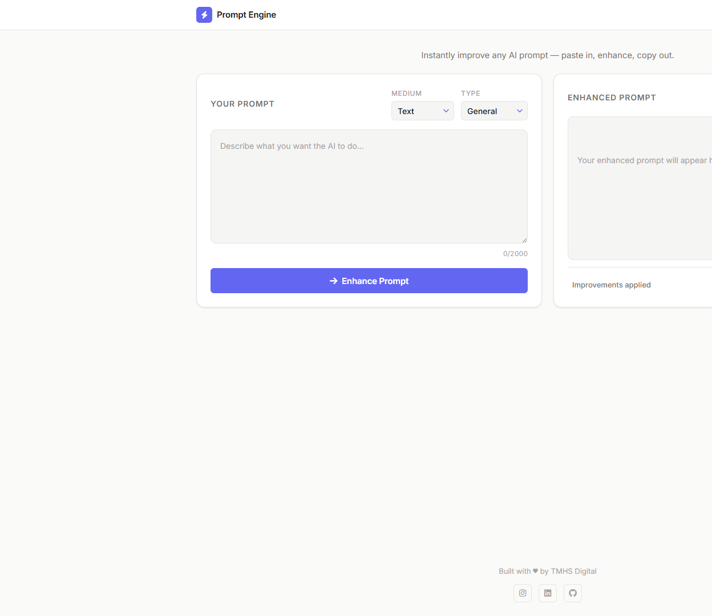
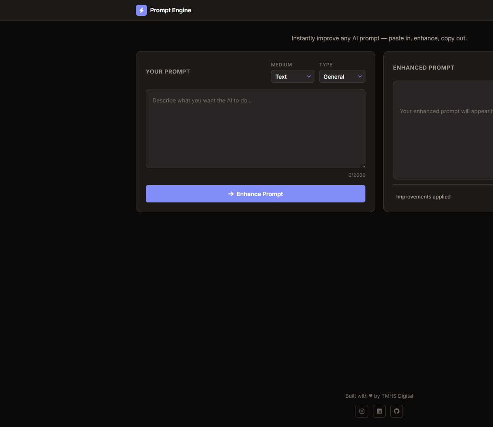

# Prompt Engine

Transform your AI prompts with best practices and smart enhancements.

## Features

- 🚀 **Smart Prompt Enhancement**
  - Content medium selection (Text/Image)
  - Type-specific enhancements
  - Real-time processing and feedback
  - Comprehensive improvement suggestions

- 🎨 **Beautiful Interface**
  - Intuitive medium and type selection
  - Dark/Light mode with system preference detection
  - Responsive design for all devices
  - Clean, modern UI with smooth animations

- 💾 **Prompt Management**
  - Save your favorite prompts
  - View and manage prompt history
  - Quick load of previous prompts
  - Categorized prompt organization

- 🔗 **Easy Sharing**
  - Share enhanced prompts across platforms
  - Multiple sharing options:
    - Social media (LinkedIn, Instagram)
    - Messaging apps (WhatsApp, Telegram)
    - Email and direct links
    - QR code generation

## Preview

### Light Mode


### Dark Mode


## Getting Started

1. Visit [Prompt Engine](https://your-username.github.io/prompt-engine)
2. Select your content medium (Text/Image)
3. Choose the appropriate prompt type
4. Enter your prompt in the input area
5. Click "Enhance Prompt" to see the improved version
6. Use the share, copy, or save buttons to manage your prompt

## Local Development

1. Clone the repository:
   ```bash
   git clone https://github.com/your-username/prompt-engine.git
   ```

2. Open the project folder:
   ```bash
   cd prompt-engine
   ```

3. Start a local server (e.g., using Python):
   ```bash
   python -m http.server 8000
   ```

4. Visit `http://localhost:8000` in your browser

## Project Structure

```
prompt-engine/
├── css/
│   └── styles.css
├── js/
│   ├── features/
│   │   ├── darkMode.js
│   │   ├── savedPrompts.js
│   │   ├── shareFeatures.js
│   │   ├── uiFeatures.js
│   │   ├── promptTypes.js
│   │   ├── enhancementRules.js
│   │   └── promptValidator.js
│   ├── bestPractices.js
│   ├── promptEnhancer.js
│   └── main.js
├── index.html
└── footer.html
```

## Contributing

1. Fork the repository
2. Create your feature branch: `git checkout -b feature/amazing-feature`
3. Commit your changes: `git commit -m 'Add amazing feature'`
4. Push to the branch: `git push origin feature/amazing-feature`
5. Open a Pull Request

## License

This project is licensed under the MIT License - see the [LICENSE](LICENSE) file for details.

## Acknowledgments

- Thanks to all contributors who have helped shape this project
- Inspired by best practices in prompt engineering
- Built with modern web technologies
- Created by TMHS Digital 