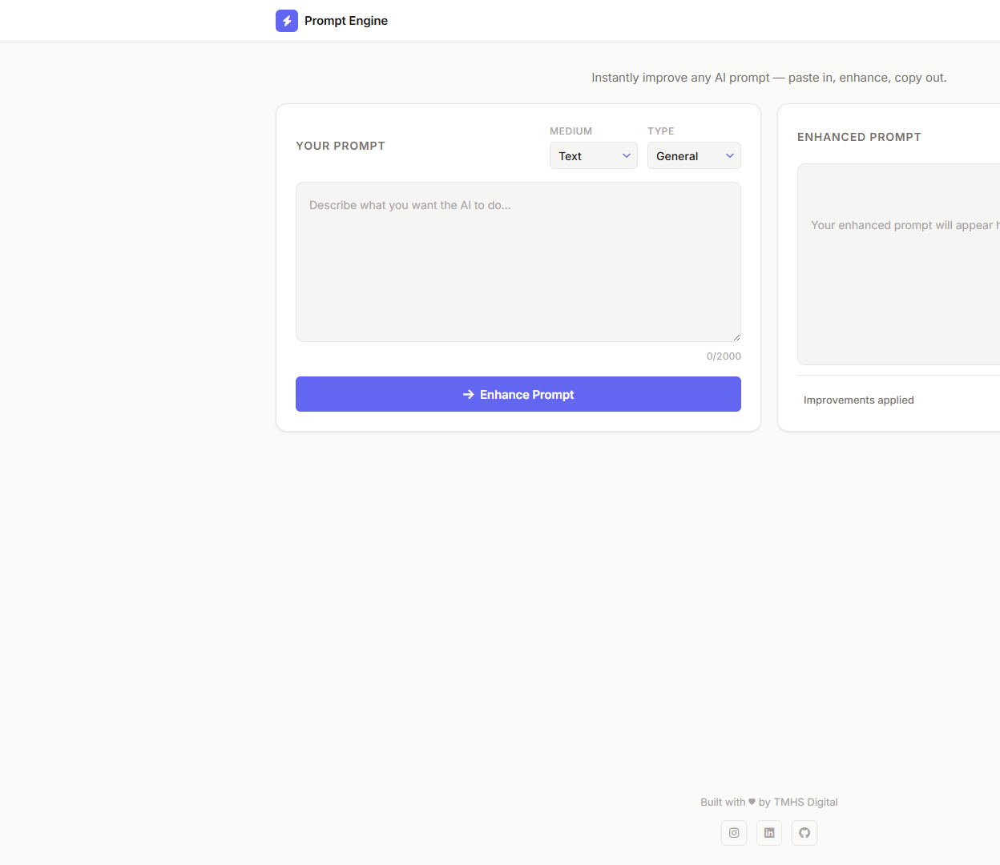
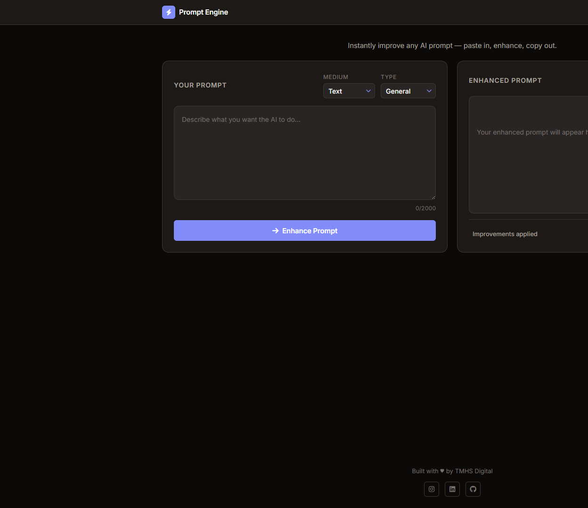
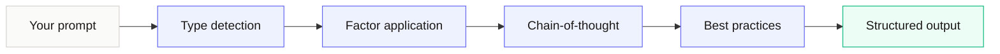

<p align="center">
  
</p>

<p align="center">
  <a href="https://github.com/TMHSDigital/prompt-generator/stargazers"></a>
  <a href="https://github.com/TMHSDigital/prompt-generator/network/members"></a>
  <a href="https://github.com/TMHSDigital/prompt-generator/commits/main"></a>
  <a href="LICENSE"></a>
  <a href="https://tmhsdigital.github.io/prompt-generator"></a>
</p>

<p align="center">
  <strong>Paste in a rough prompt → get a structured, AI-ready version out.</strong><br>
  Free, open-source, no login, no backend. Works offline as a PWA.
</p>

<p align="center">
  <a href="https://tmhsdigital.github.io/prompt-generator"><kbd>&nbsp;&nbsp;&nbsp;Try the Live Demo →&nbsp;&nbsp;&nbsp;</kbd></a>
</p>

---

## Screenshots

| Light mode | Dark mode |
|:---:|:---:|
|  |  |

---

## Before / After

See the difference in one glance:

| Raw prompt | After Prompt Engine |
|---|---|
| *"write me python code for sorting"* | **[Temperature: 0.5]** You are an AI assistant specialized in code text generation. Context: This is a code prompt for text generation. Let's break this down into steps: 1. Write me python code for sorting. Now, addressing each point: I want you to write me python code for sorting. Please respond in a professional and clear tone. Please format the output clearly and logically. Include comprehensive documentation and examples. Provide unit tests for the code. Consider adding comments and documentation to the code. Guidance: Consider requesting comments or documentation for the code. |
| *"cat sitting on a cloud"* | **[Temperature: 0.8]** You are an AI assistant specialized in generation image generation. Context: This is a generation prompt for image generation. I want you to cat sitting on a cloud. Focus on the main subject with clear composition. Ensure balanced composition and visual hierarchy. Optimize lighting for clarity and atmosphere. Convey appropriate mood and atmosphere. Style: Consider specifying an artistic style (e.g., photorealistic, cartoon, painting). Quality: Consider adding quality terms (e.g., 'high resolution', '4k', 'highly detailed'). Composition: Consider specifying composition details (e.g., 'close-up shot', 'wide angle', 'rule of thirds'). |

---

## Tech Stack

<p align="center">
  
  
  
  
  
</p>

Zero dependencies. No build step. No framework. Just vanilla JS with ES modules.

---

## What It Does

- **Transforms vague prompts into structured, high-quality instructions** ready for any AI model
- **Applies prompt-engineering best practices automatically** — chain-of-thought, temperature hints, format specs, context grounding
- **Works for text and image models** — ChatGPT, Claude, Gemini, Midjourney, Stable Diffusion, and more

---

## Use Cases

| Goal | How Prompt Engine helps |
|------|------------------------|
| **ChatGPT / Claude** | Adds role, format, tone, and constraints so the model gives precise answers |
| **Midjourney / DALL·E** | Expands sparse image ideas with style, lighting, composition, and mood parameters |
| **Coding assistants** | Structures your request with language, paradigm, error-handling, and test requirements |
| **Content creation** | Specifies audience, tone, length, and structure so drafts need less editing |
| **Research & summarization** | Frames depth, perspective, and output format for more useful responses |

---

## Features

**Smart Enhancement**
- Medium-aware processing (Text vs. Image)
- Type-specific rules (chat, code, completion, generation, editing, variation)
- Chain-of-thought and temperature hints applied automatically
- AI-powered prompt type auto-detection

**Prompt Management**
- Save, search, and reload prompt history (localStorage)
- Export / import history as JSON
- Load shared prompts from URL parameters

**Sharing**
- Copy to clipboard
- Share via Twitter, LinkedIn, WhatsApp, Telegram, Email
- QR code generation
- Direct shareable link (includes medium + type)

**Interface**
- Dark-first developer tool aesthetic — Inter + JetBrains Mono typography
- Warm stone/indigo design system with CSS custom properties
- Compact sticky topbar with inline dark/light toggle
- Improvements shown as collapsible pill tags in the output card
- PWA — installable as a desktop or mobile app
- Fully offline after first load
- No login, no backend, no data leaves your browser

---

## Quick Start

**Use online (no setup):**

```
https://tmhsdigital.github.io/prompt-generator
```

**Run locally:**

```bash
git clone https://github.com/TMHSDigital/prompt-generator.git
cd prompt-generator
python -m http.server 8000
# open http://localhost:8000
```

> ES modules require a real server — opening `index.html` directly via `file://` won't work in most browsers.

---

## Deploy Your Own

1. Fork this repo
2. Go to **Settings → Pages → Source**: `main` branch / root
3. Your instance is live at `https://yourusername.github.io/prompt-generator`

No build step, no CI, no config — pure static files.

---

## How It Works


```mermaid
flowchart LR
    A["Your prompt"] --> B["Type detection"]
    B --> C["Factor application"]
    C --> D["Chain-of-thought"]
    D --> E["Best practices"]
    E --> F["Structured output"]

    style A fill:#fafaf9,stroke:#d6d3d1,color:#1c1917
    style B fill:#eef2ff,stroke:#6366f1,color:#1c1917
    style C fill:#eef2ff,stroke:#6366f1,color:#1c1917
    style D fill:#eef2ff,stroke:#6366f1,color:#1c1917
    style E fill:#eef2ff,stroke:#6366f1,color:#1c1917
    style F fill:#ecfdf5,stroke:#10b981,color:#1c1917
```

Enhancement rules live in [`js/features/enhancementRules.js`](js/features/enhancementRules.js). Prompt types and their factors are defined in [`js/features/promptTypes.js`](js/features/promptTypes.js).

---

## Project Structure

```
prompt-generator/
├── index.html                 # App shell
├── css/
│   └── styles.css             # Design system (CSS custom properties)
├── js/
│   ├── main.js                # Entry point — wires everything together
│   ├── ui.js                  # Formatting, notifications, dialogs, dark mode
│   ├── share.js               # Clipboard, platform dialog, share dispatch
│   ├── storage.js             # Save/load/search/export/import prompts
│   └── features/
│       ├── promptEnhancer.js  # Core enhancement engine
│       ├── enhancementRules.js# Enhancement rule definitions
│       ├── promptTypes.js     # Medium and type definitions
│       ├── promptValidator.js # Input validation
│       ├── aiSuggestions.js   # Rule-based suggestion system
│       ├── shareFeatures.js   # Platform-specific share logic
│       ├── storageManager.js  # localStorage CRUD wrapper
│       ├── darkMode.js        # Theme management
│       ├── savedPrompts.js    # Saved prompts UI
│       └── uiFeatures.js     # UI feature aggregator
├── manifest.webmanifest       # PWA manifest
├── sw.js                      # Service worker (offline support)
└── example-prompts.json       # Sample prompts for import
```

---

## Contributing

Contributions are welcome. See [CONTRIBUTING.md](CONTRIBUTING.md) for how to:
- Run the project locally
- Add a new prompt type or enhancement rule
- Submit a pull request

Browse [open issues](https://github.com/TMHSDigital/prompt-generator/issues) for ideas.

---

## Topics

Add these in **Settings → Topics** to improve discoverability:

`prompt-engineering` `ai-tools` `chatgpt` `llm` `claude-ai` `midjourney` `javascript` `pwa` `productivity` `open-source`

---

## Star History

<p align="center">
  <a href="https://star-history.com/#TMHSDigital/prompt-generator&Date">
    
  </a>
</p>

---

## License

MIT — see [LICENSE](LICENSE).

---

<p align="center">
  <em>Built by <a href="https://github.com/TMHSDigital">TMHS Digital</a></em>
</p>


