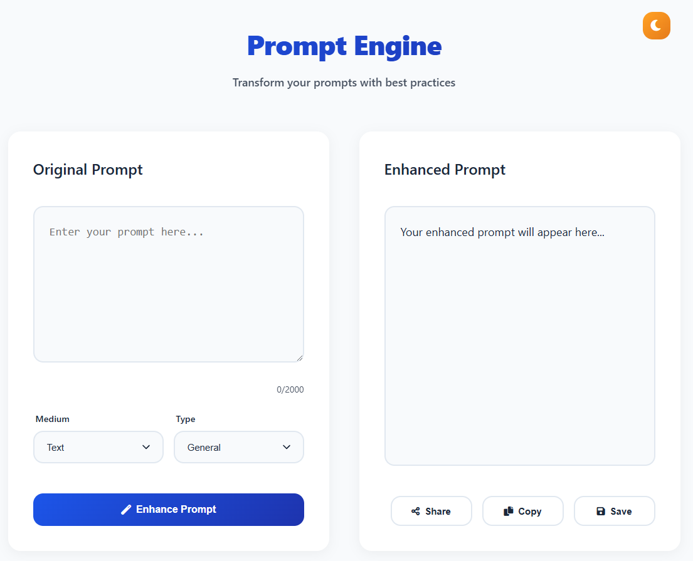
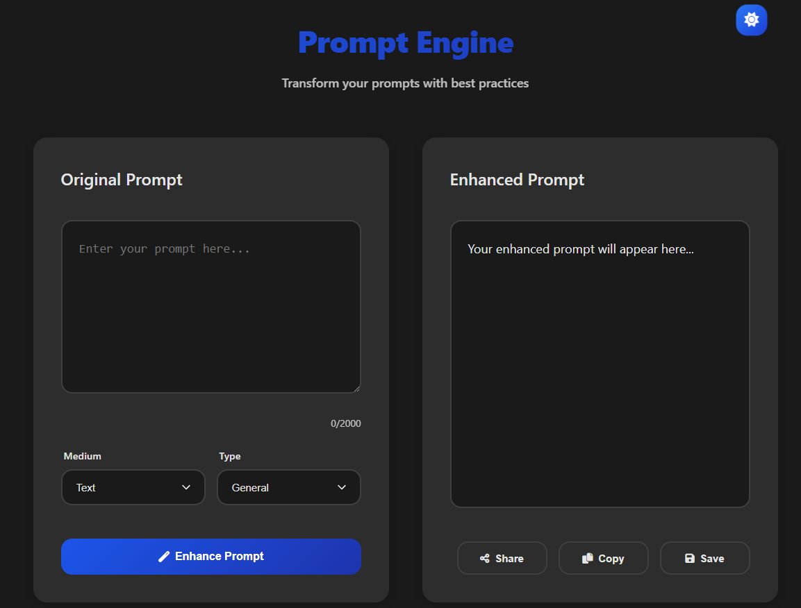

# Prompt Engine

Transform your prompts with best practices - A powerful tool for enhancing AI prompts.

## 🌟 Preview

### Light Mode


### Dark Mode


## 🚀 Features

- **Smart Prompt Enhancement**: Automatically improve your prompts based on best practices
- **Multiple Prompt Types**:
  - General Purpose
  - Completion Tasks
  - Chat Interactions
  - Image Generation
- **Real-time Processing**: Instant enhancement with live feedback
- **Improvement Tracking**: See exactly what enhancements were made
- **Easy Sharing**: Multiple sharing options including:
  - Social Media (Twitter, LinkedIn, Facebook)
  - Messaging (WhatsApp, Telegram)
  - Email
  - Direct Link
  - QR Code
- **Dark Mode**: Comfortable viewing in any lighting condition
- **Mobile Responsive**: Works seamlessly on all devices
- **Local Storage**: Save your prompts for later use
- **Zero Cost**: Completely free and runs entirely in your browser

## 🎯 Use Cases

- **AI Artists**: Improve image generation prompts for better results
- **Developers**: Create better API prompts for AI models
- **Writers**: Enhance creative writing prompts
- **Educators**: Develop clear instructional prompts
- **Researchers**: Refine research queries for AI systems

## 🛠️ Technical Details

- **Frontend**: Pure JavaScript/HTML/CSS
- **Storage**: Local browser storage for saved prompts
- **Hosting**: GitHub Pages
- **Dependencies**: None (Zero external dependencies)
- **Performance**: Lightweight and fast, runs entirely client-side

## 💡 How It Works

1. **Select Prompt Type**: Choose the type of prompt you want to enhance
2. **Enter Your Prompt**: Type or paste your original prompt
3. **Generate**: Click "Enhance Prompt" to apply best practices
4. **Review**: See the improvements made and the enhanced version
5. **Share or Save**: Multiple options to save or share your enhanced prompt

## 🚀 Getting Started

### Using the Web Version

1. Visit [https://tmhsdigital.github.io/prompt-generator/](https://tmhsdigital.github.io/prompt-generator/)
2. Start enhancing your prompts immediately
3. No installation or setup required

### Running Locally

1. Clone the repository:
   ```bash
   git clone https://github.com/TMHSDigital/prompt-generator.git
   ```

2. Navigate to the project directory:
   ```bash
   cd prompt-generator
   ```

3. Open `index.html` in your browser or use a local server:
   ```bash
   # Using Python
   python -m http.server 8000
   
   # Using Node.js
   npx serve
   ```

## 🤝 Contributing

We welcome contributions! Here's how you can help:

1. Fork the repository
2. Create a feature branch: `git checkout -b feature/amazing-feature`
3. Commit your changes: `git commit -m 'Add amazing feature'`
4. Push to the branch: `git push origin feature/amazing-feature`
5. Open a Pull Request

## 📝 Best Practices

Our prompt enhancement engine follows these key principles:

- **Clarity**: Ensuring prompts are clear and unambiguous
- **Context**: Adding necessary context for better understanding
- **Specificity**: Making prompts more specific and detailed
- **Structure**: Organizing prompts in a logical manner
- **Format**: Maintaining consistent formatting
- **Output Guidance**: Providing clear expectations for outputs

## 📄 License

This project is licensed under the MIT License - see the [LICENSE](LICENSE) file for details.

## 🙏 Acknowledgments

- Built with ❤️ by TMHS Digital
- Special thanks to all contributors and users

## 📞 Support

- Create an issue for bug reports or feature requests
- Star the repository if you find it useful
- Share with others who might benefit

---

Made with ❤️ by TMHS Digital 